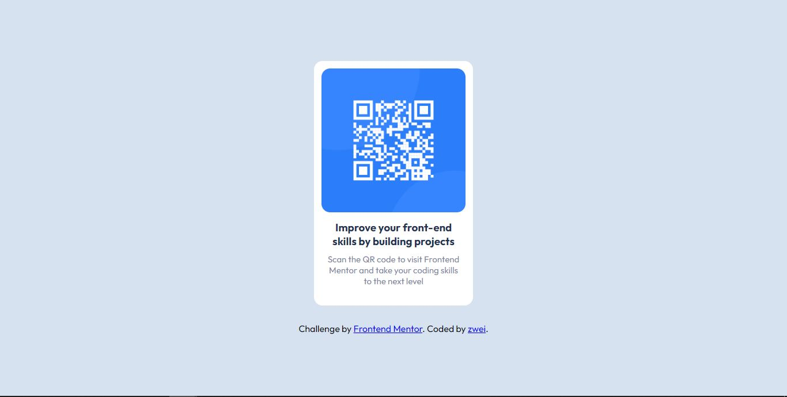

# Frontend Mentor - QR code component solution

This is a solution to the [QR code component challenge on Frontend Mentor](https://www.frontendmentor.io/challenges/qr-code-component-iux_sIO_H). Frontend Mentor challenges help you improve your coding skills by building realistic projects.

## Table of contents

- [Overview](#overview)
  - [Screenshot](#screenshot)
  - [Built with](#built-with)
- [Author](#author)
- [Acknowledgments](#acknowledgments)

## Overview

QRCode Challange by Frontendmentor using HTML and CSS

### Screenshot

### Links

- Solution URL: [Add solution URL here](https://www.frontendmentor.io/solutions/qrcode-challange-using-html-and-css-9M-zMniQwW)
- Live Site URL: [Add live site URL here](https://zwei9lake.github.io/qr-code-challange/)

### Built with

- Semantic HTML5 markup
- CSS
- Flexbox

## Author

- Frontend Mentor - [@zwei9lake](https://www.frontendmentor.io/profile/zwei9lake)
